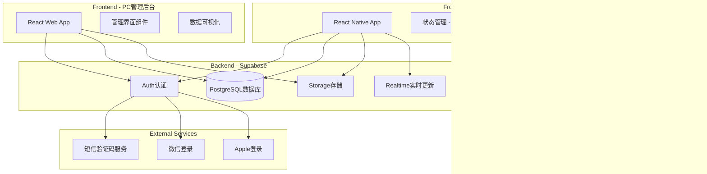
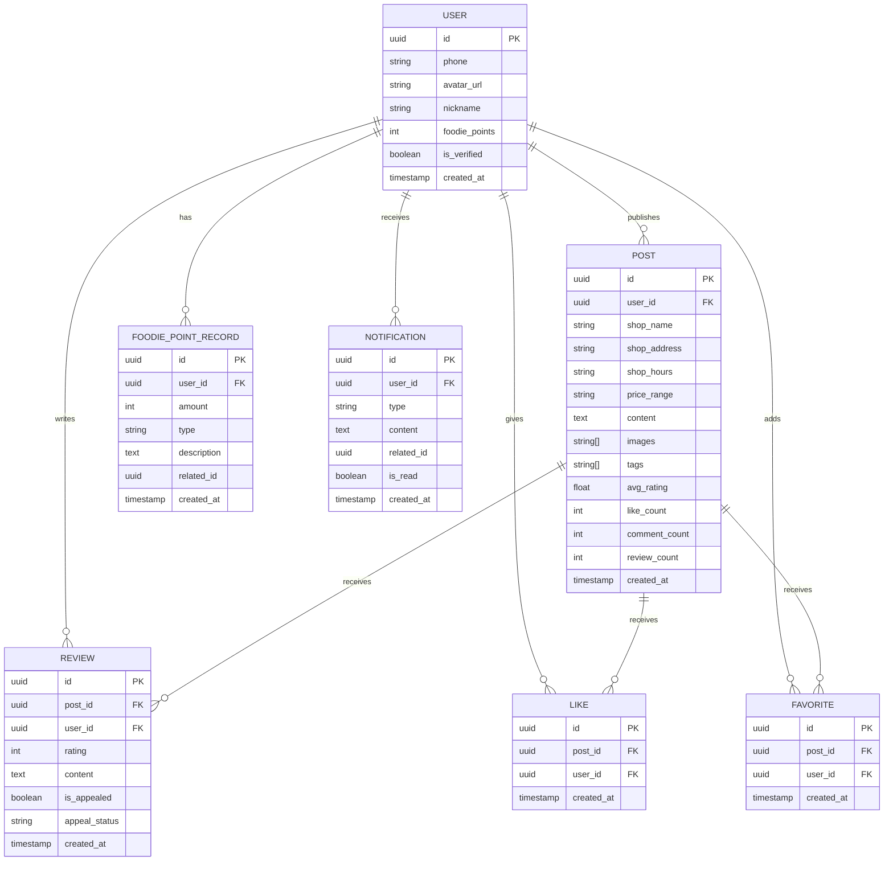

# 老吃家 - 技术架构文档

## 1. Architecture Design



## 2. Technology Description

- **Frontend - App**: React Native 0.74 + TypeScript + Tailwind CSS (NativeWind)
- **Frontend - Admin**: React 18 + TypeScript + Tailwind CSS + Vite
- **Backend**: Supabase (PostgreSQL + Auth + Storage + Realtime)
- **State Management**: Zustand (App)
- **Image Upload**: Supabase Storage
- **Push Notifications**: OneSignal / Expo Push Notifications

## 3. Route Definitions

### App Navigation
| Route | Purpose |
|-------|---------|
| /login | 登录/注册页面 |
| /home | 首页推荐流 |
| /post/:id | 推荐详情页 |
| /new-post | 发布新推荐 |
| /profile | 个人中心 |
| /notifications | 消息中心 |
| /my-posts | 我的推荐 |
| /my-reviews | 我的评价 |
| /favorites | 我的收藏 |

### Admin Web Routes
| Route | Purpose |
|-------|---------|
| /admin/login | 运营登录页 |
| /admin/dashboard | 数据看板 |
| /admin/users | 用户管理 |
| /admin/posts | 帖子审核 |
| /admin/reviews | 评价管理 |
| /admin/appeals | 复议处理 |
| /admin/config | 吃货分规则配置 |

## 4. API Definitions

### Supabase Client SDK (Frontend only)
```typescript
// Types
interface User {
  id: string
  phone?: string
  avatar_url?: string
  nickname: string
  foodie_points: number
  is_verified?: boolean
  created_at: string
}

interface Post {
  id: string
  user_id: string
  shop_name: string
  shop_address?: string
  shop_hours?: string
  price_range?: string
  content: string
  images: string[]
  tags?: string[]
  avg_rating?: number
  like_count: number
  comment_count: number
  review_count: number
  created_at: string
}

interface Review {
  id: string
  post_id: string
  user_id: string
  rating: 1 | 2 | 3 | 4 | 5
  content: string
  is_appealed?: boolean
  appeal_status?: 'pending' | 'resolved' | 'dismissed'
  created_at: string
}

interface Like {
  id: string
  post_id: string
  user_id: string
  created_at: string
}

interface Favorite {
  id: string
  post_id: string
  user_id: string
  created_at: string
}

interface FoodiePointRecord {
  id: string
  user_id: string
  amount: number
  type: 'initial' | 'publish' | 'penalty' | 'reward' | 'interaction'
  description: string
  related_id?: string
  created_at: string
}

interface Notification {
  id: string
  user_id: string
  type: 'like' | 'comment' | 'review' | 'appeal' | 'system'
  content: string
  related_id?: string
  is_read: boolean
  created_at: string
}
```

## 5. Data Model

### 5.1 Data Model Definition



### 5.2 Data Definition Language (SQL)

```sql
-- Enable UUID extension
CREATE EXTENSION IF NOT EXISTS "uuid-ossp";

-- Users table
CREATE TABLE users (
  id UUID PRIMARY KEY DEFAULT uuid_generate_v4(),
  phone TEXT UNIQUE,
  avatar_url TEXT,
  nickname TEXT NOT NULL DEFAULT '美食家',
  foodie_points INTEGER NOT NULL DEFAULT 100,
  is_verified BOOLEAN NOT NULL DEFAULT false,
  created_at TIMESTAMPTZ NOT NULL DEFAULT NOW()
);

-- Posts table
CREATE TABLE posts (
  id UUID PRIMARY KEY DEFAULT uuid_generate_v4(),
  user_id UUID NOT NULL REFERENCES users(id) ON DELETE CASCADE,
  shop_name TEXT NOT NULL,
  shop_address TEXT,
  shop_hours TEXT,
  price_range TEXT,
  content TEXT NOT NULL,
  images TEXT[] NOT NULL DEFAULT '{}',
  tags TEXT[] DEFAULT '{}',
  avg_rating NUMERIC(3, 2),
  like_count INTEGER NOT NULL DEFAULT 0,
  comment_count INTEGER NOT NULL DEFAULT 0,
  review_count INTEGER NOT NULL DEFAULT 0,
  created_at TIMESTAMPTZ NOT NULL DEFAULT NOW()
);

-- Reviews table
CREATE TABLE reviews (
  id UUID PRIMARY KEY DEFAULT uuid_generate_v4(),
  post_id UUID NOT NULL REFERENCES posts(id) ON DELETE CASCADE,
  user_id UUID NOT NULL REFERENCES users(id) ON DELETE CASCADE,
  rating INTEGER NOT NULL CHECK (rating >= 1 AND rating <= 5),
  content TEXT NOT NULL,
  is_appealed BOOLEAN NOT NULL DEFAULT false,
  appeal_status TEXT,
  created_at TIMESTAMPTZ NOT NULL DEFAULT NOW()
);

-- Likes table
CREATE TABLE likes (
  id UUID PRIMARY KEY DEFAULT uuid_generate_v4(),
  post_id UUID NOT NULL REFERENCES posts(id) ON DELETE CASCADE,
  user_id UUID NOT NULL REFERENCES users(id) ON DELETE CASCADE,
  created_at TIMESTAMPTZ NOT NULL DEFAULT NOW(),
  UNIQUE(post_id, user_id)
);

-- Favorites table
CREATE TABLE favorites (
  id UUID PRIMARY KEY DEFAULT uuid_generate_v4(),
  post_id UUID NOT NULL REFERENCES posts(id) ON DELETE CASCADE,
  user_id UUID NOT NULL REFERENCES users(id) ON DELETE CASCADE,
  created_at TIMESTAMPTZ NOT NULL DEFAULT NOW(),
  UNIQUE(post_id, user_id)
);

-- Foodie point records table
CREATE TABLE foodie_point_records (
  id UUID PRIMARY KEY DEFAULT uuid_generate_v4(),
  user_id UUID NOT NULL REFERENCES users(id) ON DELETE CASCADE,
  amount INTEGER NOT NULL,
  type TEXT NOT NULL CHECK (type IN ('initial', 'publish', 'penalty', 'reward', 'interaction')),
  description TEXT NOT NULL,
  related_id UUID,
  created_at TIMESTAMPTZ NOT NULL DEFAULT NOW()
);

-- Notifications table
CREATE TABLE notifications (
  id UUID PRIMARY KEY DEFAULT uuid_generate_v4(),
  user_id UUID NOT NULL REFERENCES users(id) ON DELETE CASCADE,
  type TEXT NOT NULL CHECK (type IN ('like', 'comment', 'review', 'appeal', 'system')),
  content TEXT NOT NULL,
  related_id UUID,
  is_read BOOLEAN NOT NULL DEFAULT false,
  created_at TIMESTAMPTZ NOT NULL DEFAULT NOW()
);

-- Create indexes
CREATE INDEX idx_posts_user_id ON posts(user_id);
CREATE INDEX idx_posts_created_at ON posts(created_at DESC);
CREATE INDEX idx_reviews_post_id ON reviews(post_id);
CREATE INDEX idx_reviews_user_id ON reviews(user_id);
CREATE INDEX idx_likes_post_id ON likes(post_id);
CREATE INDEX idx_likes_user_id ON likes(user_id);
CREATE INDEX idx_favorites_post_id ON favorites(post_id);
CREATE INDEX idx_favorites_user_id ON favorites(user_id);
CREATE INDEX idx_foodie_point_records_user_id ON foodie_point_records(user_id);
CREATE INDEX idx_notifications_user_id ON notifications(user_id);
CREATE INDEX idx_notifications_created_at ON notifications(created_at DESC);

-- Row Level Security (RLS)
ALTER TABLE users ENABLE ROW LEVEL SECURITY;
ALTER TABLE posts ENABLE ROW LEVEL SECURITY;
ALTER TABLE reviews ENABLE ROW LEVEL SECURITY;
ALTER TABLE likes ENABLE ROW LEVEL SECURITY;
ALTER TABLE favorites ENABLE ROW LEVEL SECURITY;
ALTER TABLE foodie_point_records ENABLE ROW LEVEL SECURITY;
ALTER TABLE notifications ENABLE ROW LEVEL SECURITY;

-- Policies for posts (everyone can read, authenticated can create)
CREATE POLICY "Posts are viewable by everyone" ON posts FOR SELECT USING (true);
CREATE POLICY "Authenticated users can create posts" ON posts FOR INSERT WITH CHECK (auth.uid() = user_id);
CREATE POLICY "Users can update their own posts" ON posts FOR UPDATE USING (auth.uid() = user_id);
CREATE POLICY "Users can delete their own posts" ON posts FOR DELETE USING (auth.uid() = user_id);

-- Policies for users (users can view their own profile)
CREATE POLICY "Users can view public profiles" ON users FOR SELECT USING (true);
CREATE POLICY "Users can update their own profile" ON users FOR UPDATE USING (auth.uid() = id);

-- Policies for reviews
CREATE POLICY "Reviews are viewable by everyone" ON reviews FOR SELECT USING (true);
CREATE POLICY "Authenticated users can create reviews" ON reviews FOR INSERT WITH CHECK (auth.uid() = user_id);
CREATE POLICY "Users can update their own reviews" ON reviews FOR UPDATE USING (auth.uid() = user_id);
CREATE POLICY "Users can delete their own reviews" ON reviews FOR DELETE USING (auth.uid() = user_id);

-- Policies for likes
CREATE POLICY "Likes are viewable by everyone" ON likes FOR SELECT USING (true);
CREATE POLICY "Authenticated users can create likes" ON likes FOR INSERT WITH CHECK (auth.uid() = user_id);
CREATE POLICY "Users can delete their own likes" ON likes FOR DELETE USING (auth.uid() = user_id);

-- Policies for favorites
CREATE POLICY "Favorites are viewable by owner" ON favorites FOR SELECT USING (auth.uid() = user_id);
CREATE POLICY "Authenticated users can create favorites" ON favorites FOR INSERT WITH CHECK (auth.uid() = user_id);
CREATE POLICY "Users can delete their own favorites" ON favorites FOR DELETE USING (auth.uid() = user_id);

-- Policies for foodie point records
CREATE POLICY "Foodie point records are viewable by owner" ON foodie_point_records FOR SELECT USING (auth.uid() = user_id);

-- Policies for notifications
CREATE POLICY "Notifications are viewable by owner" ON notifications FOR SELECT USING (auth.uid() = user_id);
CREATE POLICY "Users can update their own notifications" ON notifications FOR UPDATE USING (auth.uid() = user_id);

-- Grant permissions
GRANT SELECT ON users TO anon, authenticated;
GRANT SELECT, INSERT, UPDATE, DELETE ON posts TO authenticated;
GRANT SELECT, INSERT, UPDATE, DELETE ON reviews TO authenticated;
GRANT SELECT, INSERT, DELETE ON likes TO authenticated;
GRANT SELECT, INSERT, DELETE ON favorites TO authenticated;
GRANT SELECT ON foodie_point_records TO authenticated;
GRANT SELECT, UPDATE ON notifications TO authenticated;

-- Create storage bucket for images
INSERT INTO storage.buckets (id, name, public) VALUES ('food-images', 'food-images', true);

-- Storage policy for public access
CREATE POLICY "Public can view images" ON storage.objects FOR SELECT USING (bucket_id = 'food-images');
CREATE POLICY "Authenticated users can upload images" ON storage.objects FOR INSERT WITH CHECK (bucket_id = 'food-images' AND auth.role() = 'authenticated');
CREATE POLICY "Users can update their own images" ON storage.objects FOR UPDATE USING (bucket_id = 'food-images' AND auth.uid() = owner);
CREATE POLICY "Users can delete their own images" ON storage.objects FOR DELETE USING (bucket_id = 'food-images' AND auth.uid() = owner);
```

### 5.3 Database Functions (For foodie points)

```sql
-- Function to calculate and update average rating for a post
CREATE OR REPLACE FUNCTION update_post_avg_rating()
RETURNS TRIGGER AS $$
BEGIN
  UPDATE posts
  SET avg_rating = (
    SELECT AVG(rating)::NUMERIC(3, 2)
    FROM reviews
    WHERE post_id = NEW.post_id OR post_id = OLD.post_id
  )
  WHERE id = COALESCE(NEW.post_id, OLD.post_id);
  RETURN NEW;
END;
$$ LANGUAGE plpgsql;

CREATE TRIGGER trigger_update_post_avg_rating
AFTER INSERT OR UPDATE OR DELETE ON reviews
FOR EACH ROW
EXECUTE FUNCTION update_post_avg_rating();

-- Function to update counts on like
CREATE OR REPLACE FUNCTION update_post_like_count()
RETURNS TRIGGER AS $$
BEGIN
  IF TG_OP = 'INSERT' THEN
    UPDATE posts SET like_count = like_count + 1 WHERE id = NEW.post_id;
  ELSIF TG_OP = 'DELETE' THEN
    UPDATE posts SET like_count = like_count - 1 WHERE id = OLD.post_id;
  END IF;
  RETURN NEW;
END;
$$ LANGUAGE plpgsql;

CREATE TRIGGER trigger_update_post_like_count
AFTER INSERT OR DELETE ON likes
FOR EACH ROW
EXECUTE FUNCTION update_post_like_count();

-- Function to update review count
CREATE OR REPLACE FUNCTION update_post_review_count()
RETURNS TRIGGER AS $$
BEGIN
  IF TG_OP = 'INSERT' THEN
    UPDATE posts SET review_count = review_count + 1 WHERE id = NEW.post_id;
  ELSIF TG_OP = 'DELETE' THEN
    UPDATE posts SET review_count = review_count - 1 WHERE id = OLD.post_id;
  END IF;
  RETURN NEW;
END;
$$ LANGUAGE plpgsql;

CREATE TRIGGER trigger_update_post_review_count
AFTER INSERT OR DELETE ON reviews
FOR EACH ROW
EXECUTE FUNCTION update_post_review_count();
```

## 6. Project Structure

```
/laochijia/
├── app/                      # React Native app
│   ├── src/
│   │   ├── components/       # UI组件
│   │   ├── screens/          # 页面
│   │   ├── hooks/            # 自定义hooks
│   │   ├── stores/           # Zustand状态管理
│   │   ├── lib/              # Supabase客户端等
│   │   └── types/            # TypeScript类型
│   ├── package.json
│   └── ...
├── admin/                    # PC管理后台
│   ├── src/
│   │   ├── components/
│   │   ├── pages/
│   │   ├── lib/
│   │   └── types/
│   ├── package.json
│   └── ...
└── supabase/                 # Supabase配置
    ├── migrations/
    └── seed.sql
```
