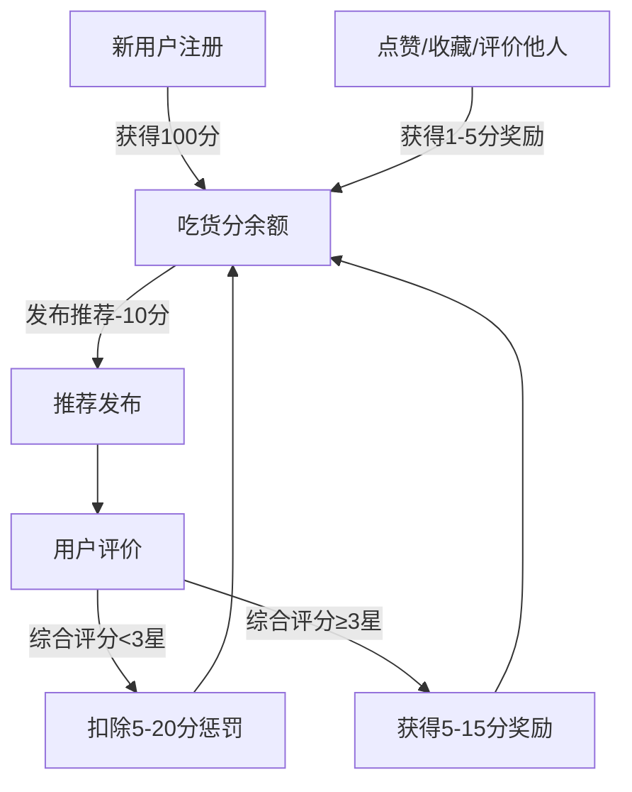

# 老吃家 - 产品需求文档 (PRD)

## 1. Product Overview
"老吃家"是一个专注于资深吃货互相推荐美食的社区平台，通过吃货分机制和特色五星评分体系，确保推荐质量，打造可信赖的美食发现平台。
- 解决现有美食平台推荐质量参差不齐、虚假评价多的问题
- 目标用户：资深吃货、美食探店爱好者、注重真实体验的美食探索者

## 2. Core Features

### 2.1 User Roles
| Role | Registration Method | Core Permissions |
|------|---------------------|------------------|
| 普通用户 | 手机号/微信/Apple ID | 浏览推荐、发布评价、互动交流 |
| 美食达人 | 认证申请 | 更高曝光、专属活动 |
| 运营方 | 后台账号 | 用户管理、内容审核、数据统计 |

### 2.2 Feature Module
1. **首页/推荐流**: 瀑布流推荐卡片、筛选排序
2. **发布推荐**: 店铺信息、图片上传、推荐理由
3. **推荐详情**: 店铺信息、推荐内容、评论区、差评区
4. **品尝评价**: 五星评分、评价内容、复议功能
5. **个人中心**: 我的推荐、我的评价、吃货分记录、收藏
6. **消息中心**: 互动通知、系统通知
7. **PC管理后台**: 用户管理、内容审核、数据统计、规则配置

### 2.3 Page Details
| Page Name | Module Name | Feature description |
|-----------|-------------|---------------------|
| 首页 | 推荐流 | 瀑布流卡片展示、下拉刷新、筛选排序 |
| 推荐详情 | 店铺信息 | 店铺名称、地址、营业时间、人均消费 |
| 推荐详情 | 评论区 | 普通评论列表、单独的差评区展示 |
| 发布推荐 | 发布表单 | 图片上传、店铺信息、推荐理由、标签 |
| 品尝评价 | 评分组件 | 五星选择器、特色文案提示、评价内容 |
| 个人中心 | 用户信息 | 头像、昵称、吃货分展示 |
| 消息中心 | 通知列表 | 互动通知、系统通知、标记已读 |

## 3. Core Process

### 3.1 主要用户流程
新用户注册 → 获得初始吃货分 → 浏览推荐 → 收藏/点赞感兴趣的推荐 → 去店品尝 → 提交五星评价 → 获得吃货分奖励 → 用吃货分发布自己的推荐 → 其他用户评价 → 获得/扣除吃货分 → 持续循环

### 3.2 评价流程
浏览推荐 → 点击"我去吃过" → 选择星级评分（一星到五星对应特色文案）→ 撰写评价内容 → 提交评价 → 评价展示在评论区（一星/二星在差评区）→ 推荐作者/其他用户可对评价发起复议 → 运营方处理复议

### 3.3 吃货分机制

## 4. User Interface Design

### 4.1 Design Style
- **设计风格**: 极简主义，参考苹果官网设计语言
- **主色调参考**（吃货相关配色）：
  - **方案1 - 暖橙系**: `#FF6B35`（暖橙）- 温暖有食欲，`#F7C59F`（浅橙）- 辅助色，`#333333`（深灰）- 文字
  - **方案2 - 酒红系**: `#C81D25`（酒红）- 高级感，`#FFDAB9`（蜜桃）- 辅助色，`#222222`（深黑）- 文字
  - **方案3 - 芥末绿系**: `#88B04B`（芥末绿）- 清新健康，`#F0EAD6`（奶油）- 辅助色，`#333333`（深灰）- 文字
- **按钮风格**: 圆角矩形，圆角24px，轻微阴影，hover有微妙缩放
- **字体**: 中文使用PingFang SC/Noto Sans SC，英文使用SF Pro Display/Inter
- **布局风格**: 卡片式布局，大量留白，网格对齐
- **图标风格**: 简约线性图标，统一24x24尺寸

### 4.2 Page Design Overview

| Page Name | Module Name | UI Elements |
|-----------|-------------|-------------|
| 首页 | 推荐卡片 | 白色圆角卡片(16px)、大图预览、店铺名、评分星、推荐摘要、发布者信息 |
| 发布推荐 | 发布页 | 半屏照片选择、店铺信息输入区、标签选择、吃货分消耗提示、提交按钮 |
| 推荐详情 | 评分组件 | 五星点击区域、对应文案实时显示、评价输入框、提交按钮 |
| 推荐详情 | 差评区 | 独立卡片区域、橙色/红色边框、醒目标题、评价列表、折叠展开 |
| 个人中心 | 吃货分展示 | 大号数字显示、余额醒目、变动记录列表、积分获取指南 |
| 个人中心 | 我的推荐 | 缩略卡片、评分显示、评价数量、互动数据 |

### 4.3 交互设计要点
- **评分交互**: 点击星星有微妙的弹性动画，评分文案随星级变化有平滑过渡
- **差评区**: 默认折叠，点击展开有平滑动画，颜色突出
- **吃货分变化**: 积分增减时有数字滚动动画，视觉反馈明显
- **卡片交互**: 卡片点击有轻微下沉动画，返回时有回弹效果

### 4.4 Responsiveness
- **移动端优先**: 主要面向iOS和Android手机
- **平板适配**: 优化多列布局
- **PC端**: 管理后台专门设计桌面端界面
- **触摸优化**: 所有可点击区域最小44x44px，手势流畅

### 4.5 设计调性
- 极简但有温度
- 美食图片是主角
- 配色激发食欲但不刺眼
- 交互流畅自然
